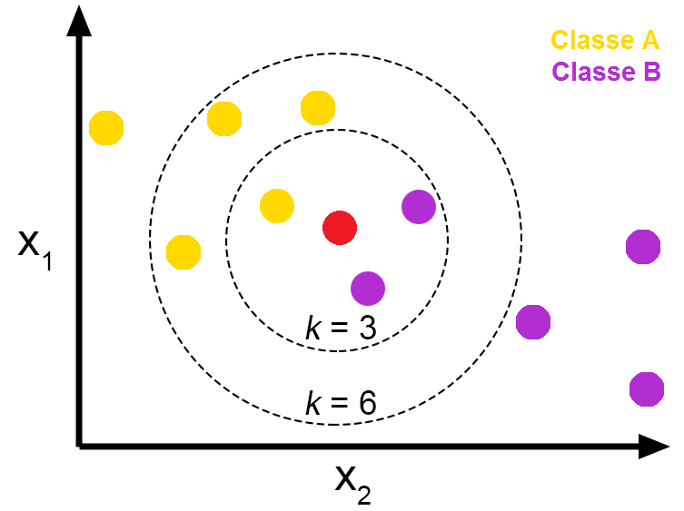

```{r setup, include=FALSE}

knitr::opts_chunk$set(echo = TRUE)
library(caret)

```

# Introduction

The **k-nearest neighbors algorithm (k-NN)** is a non-parametric supervised learning method. Non-parametric meaning the algorithm does not make any distributional assumptions about the data, and supervised meaning data with labels is used. 

>"The k-nearest neighbors algorithm (k-NN) was first developed by Evelyn Fix and Joseph Hodges in 1951, and later expanded by Thomas Cover. It is used for classification and regression. In both cases, the input consists of the k closest training examples in a data set. In k-NN classification, the output is a class membership. An object is classified by a plurality vote of its neighbors, with the object being assigned to the class most common among its k nearest neighbors (k is a positive integer, typically small). If k = 1, then the object is simply assigned to the class of that single nearest neighbor.In k-NN regression, the output is the property value for the object. This value is the average of the values of k nearest neighbors  - Wikipedia"

In simple terms, the algorithm is passed a data set with labels, and a new point which is not in the provided data. The algorithm uses the proximity of other points from the data set near the new data point to make predictions about the individual point. This prediction can either be a classification, or a numeric value. Pictures always help, so lets take a look at one!  

## Visual example

```{r echo = F, out.extra='style="float:right; padding:10px"'}

```

In the beside image we have two features, namely $X_{1}$ and $X_{2}$. We also have two classes, A and B, which are respectively denoted by yellow and purple points. Our new point which is to be classified or regressed on is red. You might already be guessing how some of the terms such as 'proximity' and 'plurality vote' factor into this algorithm from the image, but I will spell it out for you JIC. So to assign the red point a class we look at its $k$ nearest neighbors. The word neighbor implies nearness. So we look at the points that are closest to the red point. For $k=1$, this is the single closes point, for $k=2$ this is the two closest points, for $k=3$ this is the three closest points and so on. Now, consider the $k=3$ case show in the image. Of the three closest points to the red point, two are purple and one is yellow. If a 'plurality vote' was two occur, one yellow point would vote that the red point should be assigned to class A, whereas two purple points would vote that it should be class B. Clearly, the purple points win, so the red point would be assigned to class B. But this will not always be the case. With $k=6$ it is direct that yellow points outnumber the purple, and hence the 'vote' is won by the yellow points; the red point will be assigned to class A.

## An interesting case

There is always the chance that there will be an **equal amount of the 'highest vote number'** for some $k$. This means when the vote occurred, there was an equal amount of points belonging to two or more different classes (tied values). There are multiple ways to eliminate this tie.

* *Choose a different* $k$: A tie will likely not exist for all potential values of $k$. So we can change our $k$. Simple enough. But arbitrarily choosing any other $k$ does not ensure that there will be no ties

* *Randomly choose between the tied values*: Just as the name suggests

* *Allow in until natural stop*: This one is a little more nuanced than the others. Choose the smallest number $k$ where $k \geq 2$ such that there exists no ties

# Distance metrics

Since it has been established that the k-NN algorithm uses the notion of proximity, it is important to also quantify how we can measure such

## Euclidean distance

**Euclidean distance** is a perhaps the most common and well known measure of distance in mathematics. As I recall from my golden high school days, it is used just about everywhere; `complex numbers`, `vectors`, `trigonometry`, `calculus` and so on.

> "In mathematics, the Euclidean distance between two points in Euclidean space is the length of a line segment between the two points. It can be calculated from the Cartesian coordinates of the points using the Pythagorean theorem, therefore occasionally being called the Pythagorean distance."

```{r echo = F, out.extra='style="float:right; padding:10px"'}
knitr::include_graphics("images/euclidis.png")
```

In two-dimensions the Euclidean distance is simple enough. It follows directly from Pythagoras theorem, and is nothing more than the sum of the squared differences of the $x$ and $y$ coordinates. Suppose we have two points in the Cartesian space $p = (p_{1}, p_{2})$ and $q = (q_{1}, q_{2})$. Then the Euclidean distance is

\begin{align*}

d(p,q) = \sqrt{(q_{1}-p_{1})^2 +(q_{2}-p_{2})^2}

\end{align*}

Some fancy geometric proofs, and pattern observing lands us the $n$ dimensional Euclidean distance, which is not too different from the two dimensional one. Suppose we have two points in a $n$ dimensional space, $p = (p_{1}, p_{2}, ... , p_{n})$ and $q = (q_{1}, q_{2}, ... , q_{n})$ . Then the Euclidean distance is 
\begin{align*}

d(p,q) = \sqrt{(q_{1}-p_{1})^2 + (q_{2}-p_{2})^2 + (q_{3}-p_{3})^2 + ... + (q_{n}-p_{n})^2}

\end{align*}

This is the metric I will use to establish 'proximity' later due to its simplicity, and appropriateness for the latter notion. But it is important to note that the Euclidean distance does not perform as well in very high dimensions numbers. Enter, **the curse of dimensionality**!. 

> "The curse of dimensionality refers to various phenomena that arise when analyzing and organizing data in high-dimensional spaces that do not occur in low-dimensional settings such as the three-dimensional physical space of everyday experience. The curse of dimensionality in the k-NN context basically means that Euclidean distance is unhelpful in high dimensions because all vectors are almost equidistant to the search query vector"

Just to spice things up, I will throw another distance metric into the bag, but lets first encode the euclidean distance metric


```{r}
get_euclid <- function(p, q){
  #Check for same length
  if(length(p) != length(q)) return("Error, unequal length!")
  #Calculate distance
  distance = sqrt(sum((q-p)^2))
  return(distance)
}
```

## Chebyshev's distance

# Data format 

There are two different data formats which we consider. In the case of classification, the input data should take the format

\begin{bmatrix}
  X_{1} & X_{2} & X_{3} & X_{4} & \dots & X_{n} & Y
\end{bmatrix}

where $X_{1}, ... , X_{n}$ are the $n$ feature vectors. $Y$ is the vector of the labels. Regression carries the exact same format except $Y$ should now be a continuous variable we want to predict.

# The majority vote helper

The majority vote helper conducts the 'plurality vote' that was described earlier; it takes the $k$ nearest labels and returns the dominataing label. Note that labels is a vector of the $k$-nearest neighbors labels from closest to farthest. The helper will also have a tie-breaking mechanism that was described earlier built into it. When a tie occurs, the function iteratively removes the furthest label from the labels vector until the tie no longer exists. This helper is only useful in the case of classification.

```{r}
get_majority_vote <- function(labels){
  #Vote frequencies and max
  votefreq = as.data.frame(table(labels))
  votemax = max(votefreq[, 2])
  voteties = sum(votefreq[, 2] == votemax)
  #First case for no ties, second for ties
  if(voteties == 1){
    return(votefreq[votefreq[, 2] == votemax, ][1,1])
  } else {
    #Reduce label length 
    i = length(labels)
    while(voteties != 1){
      i = i - 1
      labels  = labels[1:i]
      votefreq = as.data.frame(table(labels))
      votemax = max(votefreq[, 2])
      voteties = sum(votefreq[, 2] == votemax)
    }
    return(votefreq[votefreq[, 2] == votemax, ][1,1])
  }
}
```

# Main algorithms 

## Classification

The kNN algorithm for classification calculates the distance between the new point and all the other points in the data set. It sorts the distances from the shortest to furthest and then chooses the $k$ smallest distances. The `get_majority_vote()` helper is called on the labels of theses $k$ smallest distances to produce the dominant label which is then returned by the function. As it turns out the regression problem is even easier than that of classification. A majority vote helper is not even required. We simply find the $k$ nearest neighbors, and average the value of the target variable to find the value for the new point. 

```{r}
knn_classify <- function(df, k, new_point, type){
  #Check the new point is of same length
  if(length(new_point) != ncol(df) - 1) return("Error, unequal length!")
  #Calculate the distances and order them
  df_euclid = df[, (ncol(df) - 1):ncol(df)] 
  df_points = as.data.frame(df[, 1:(ncol(df)-1)])
  for(i in 1:nrow(df_euclid)){
    df_euclid[i, 1] = get_euclid(p = new_point, 
                                 q = as.numeric(df_points[i, ]))
  }
  df_order = df_euclid[order(df_euclid[,1]), ]
  #Return the k-closest neighbors
  df_knn = df_order[1:k, ]
  labels_k = df_knn[, 2]
  #The dominating label
  dom_label = get_majority_vote(labels = labels_k)
  return(dom_label)
}

```

## Regression

As it turns out the regression problem is even easier than that of classification. A majority vote helper is not even required. We simply find the $k$ nearest neighbors, and average the value of the target variable to find the value for the new point. 

```{r}
knn_regress <- function(df, k, new_point){
  #Check the new point is of same length
  if(length(new_point) != ncol(df) - 1) return("Error, unequal length!")
  #Calculate the distances and order them
  df_euclid = df[, (ncol(df) - 1):ncol(df)] 
  df_points = as.data.frame(df[, 1:(ncol(df)-1)])
  for(i in 1:nrow(df_euclid)){
    df_euclid[i, 1] = get_euclid(p = new_point, 
                                 q = as.numeric(df_points[i, ]))
  }
  df_order = df_euclid[order(df_euclid[,1]), ]
  #Return the k-closest neighbors
  df_knn = df_order[1:k, ]
  #The average value
  regress_val = mean(df_knn[, 2])
  return(regress_val)
}

knn_regress(df = iris[,1:3], k = 1, new_point = c(7, 4))
```

# Evaluating model performance

One way we can evaluate the classifier is by splitting the iris data into a training and testing set. The training set will consist of points that will be used the "new points" in the testing set. We can then compare the classifications outputted by using the algorithm on the testing set versus what the classifications actually are. 

```{r}
#Train test split
set.seed(21312)
dt = sort(sample(nrow(iris), nrow(iris)*.7))
trainData <- iris[dt,]
testData <- iris[-dt,]

#Accuracy of k for dif vals on one possible split
accuracy = c()
for(j in 1:20){
for(i in 1:nrow(testData)){
testData[i, 6] = knn_classify(df = trainData, k = j, new_point = c(as.numeric(testData[i, 1:4])))
if(testData[i, 6] == testData[i, 5]){
  testData[i, 7] = TRUE
} else {
  testData[i, 7] = FALSE
}}
accuracy[j] = length(which(testData[, 7] == TRUE))/nrow(testData)
}
accuracy

#Confusion matrix for k = 5
for(i in 1:nrow(testData)){
testData[i, 6] = knn_classify(df = trainData, k = j, new_point = c(as.numeric(testData[i, 1:4])))
if(testData[i, 6] == testData[i, 5]){
  testData[i, 7] = TRUE
} else {
  testData[i, 7] = FALSE
}}
table(testData$Species, testData$V6) 

```

For $k=5$ the confusion matrix (mis-classifcation matrix), shows that the model performs quite well. Two virginica species were incorrectly classified as versicolor. One versicolor species was incorrectly classified as virginica. Else all seems well. It is also clear that for many different values of $k$, the model has 100% accuracy. This means that it can correctly classify samples from the training data set by considering the proximity to points in the train data set. A 100% accuracy is not always good. It may indicate that the k-NN model is over fitted to the data, and will not generalise to new data points. This is closely related to the notion of the `bias-variance tradeoff`


